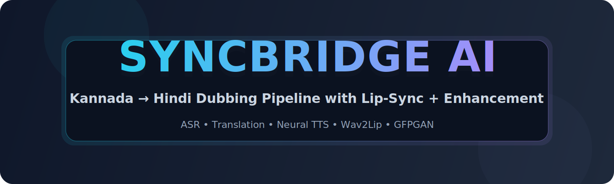
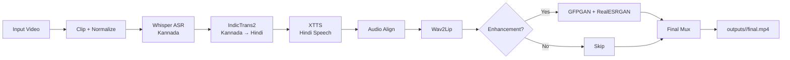

<p align="center">
	
</p>

<h1 align="center">SyncBridge AI</h1>
<p align="center">Clean Kannada → Hindi dubbing pipeline with translation, neural TTS, lip-sync, and optional enhancement.</p>

<p align="center">
	<a href="https://github.com/deimon999/SyncBridge-AI"></a>
	
	
</p>

---

## ✨ Highlights

- End-to-end Kannada → Hindi video dubbing
- Whisper ASR + IndicTrans2 translation
- XTTS-based Hindi speech generation
- Wav2Lip lip-sync with optional GFPGAN enhancement
- High-quality final muxed output at `outputs/<run_id>/final.mp4`

## ⚙️ Pipeline Stages

1. Clip extraction
2. Video/audio normalization (including 16k mono ASR input)
3. Whisper ASR (Kannada)
4. IndicTrans2 translation (Kannada → Hindi)
5. Hindi neural TTS
6. Audio duration alignment
7. Wav2Lip lip-sync
8. Optional GFPGAN + RealESRGAN enhancement
9. Final mux + encode

## 🗺️ Architecture



## 📦 Installation

### 1) Clone and enter project

```bash
git clone https://github.com/deimon999/SyncBridge-AI.git
cd SyncBridge-AI
```

### 2) Create Python environment

```bash
python -m venv .venv
# Windows PowerShell
.venv\Scripts\Activate.ps1
# macOS/Linux
# source .venv/bin/activate
```

### 3) Install Python packages

```bash
pip install -r requirements.txt
```

### 4) Install system tools

- Install `ffmpeg` + `ffprobe` and make sure both are available in `PATH`.

### 5) Add model repos/checkpoints

```bash
git clone https://github.com/Rudrabha/Wav2Lip.git Wav2Lip
mkdir -p checkpoints
# place wav2lip_gan.pth in ./checkpoints/

# optional enhancement stage
git clone https://github.com/TencentARC/GFPGAN.git GFPGAN
```

Expected required checkpoint path: `./checkpoints/wav2lip_gan.pth`

## 🧾 Dependencies (Complete)

### Python dependencies (`requirements.txt`)

- `edge-tts`
- `openai-whisper`
- `torch`
- `transformers`
- `sentencepiece`
- `sacremoses`
- `IndicTransToolkit` (installed via Git URL)
- Optional quality stage: `gfpgan`, `realesrgan`

### Non-Python runtime dependencies

- `ffmpeg`
- `ffprobe`

### External model/code dependencies

- Local `Wav2Lip` repository
- `wav2lip_gan.pth` checkpoint in `checkpoints/`
- Optional local `GFPGAN` repository

## 🚀 Quick Start

```bash
python dub_video.py --input_video "Hygiene - Kannada.mp4" --start 00:00:15 --end 00:00:45 --run_id run1
```

### Quality / Speed Options

```bash
# better ASR quality (slower)
python dub_video.py --input_video input.mp4 --run_id run_hq --whisper_model medium

# faster run without enhancement
python dub_video.py --input_video input.mp4 --run_id run_fast --no_enhance

# custom Wav2Lip checkpoint path
python dub_video.py --input_video input.mp4 --run_id run_ckpt --wav2lip_checkpoint checkpoints/wav2lip_gan.pth
```

## 🧪 Colab (TTS Stage Only)

```bash
!apt-get -y update
!apt-get -y install ffmpeg
!pip install -r requirements.txt
```

```python
from pathlib import Path
from IPython.display import Audio
from src.stages.tts_xtts import synthesize

run_id = "colab_run1"
out_dir = Path("outputs") / run_id
out_dir.mkdir(parents=True, exist_ok=True)

hindi_txt = out_dir / "hindi.txt"
hindi_txt.write_text("नमस्ते, यह एक प्राकृतिक हिंदी महिला आवाज़ का परीक्षण है।", encoding="utf-8")

ref_wav = out_dir / "audio.wav"
out_wav = out_dir / "hindi_raw.wav"

result = synthesize(hindi_txt, ref_wav if ref_wav.exists() else None, out_wav)
print("Saved:", result)
Audio(str(result))
```

## 🧩 Required / Optional Assets

### Wav2Lip (Required)

```bash
git clone https://github.com/Rudrabha/Wav2Lip.git Wav2Lip
mkdir -p checkpoints
# put wav2lip_gan.pth inside ./checkpoints/
```

Expected checkpoint: `./checkpoints/wav2lip_gan.pth`

### GFPGAN (Optional)

```bash
git clone https://github.com/TencentARC/GFPGAN.git GFPGAN
```

If GFPGAN is unavailable, pipeline falls back gracefully to non-enhanced output.

## 💰 Estimated Cost Per Minute (When Scaled)

This pipeline runs mostly on local/open models; at scale, cost is dominated by GPU/compute infrastructure and storage/egress rather than API token fees.

Assumptions for rough planning:

- 1x GPU worker around `$1.00/hour` effective blended cost (instance + overhead)
- End-to-end processing speed between `0.6x` and `1.0x` real-time
- Storage + transfer overhead around `$0.01–$0.03` per output minute

Estimated compute cost per input minute:

- At `1.0x` RT: about `$0.0167/min` compute
- At `0.6x` RT: about `$0.0278/min` compute
- With overhead: roughly **`$0.03–$0.06 per processed video minute`**

> Note: this is an infrastructure estimate, not a vendor quote. Actual cost depends on GPU type, batching, autoscaling efficiency, and whether enhancement is enabled.

## ⚠️ Known Limitations

- Single source/target path is hardcoded for Kannada → Hindi in current stage configuration.
- TTS uses a fixed Hindi neural voice (no speaker identity cloning/preservation).
- Audio alignment uses global tempo adjustment, which may reduce natural prosody on difficult clips.
- Wav2Lip and GFPGAN require separate local repos/checkpoints and can fail if not prepared correctly.
- Enhancement quality and runtime vary significantly by input resolution, compression, and face visibility.
- No built-in diarization, subtitle timing output, or speaker-level editing controls.

## 🛠️ What I’d Improve With More Time

- Add a single setup script to auto-install model repos/checkpoints and validate environment.
- Add caching for model loads and intermediate artifacts to reduce rerun cost and latency.
- Introduce segmentation + chunk-level alignment for more natural long-form dubbing.
- Add multi-speaker support with diarization and speaker-consistent voice assignment.
- Add objective quality metrics (WER/TER, sync drift) and regression test clips.
- Package as a service (queue + worker + API) with autoscaling and observability dashboards.

## 📁 Output

- Main result: `outputs/<run_id>/final.mp4`
- Intermediate artifacts are saved inside `outputs/<run_id>/`

## 🎬 Demo Videos (1 minute)

### Original Kannada Clip


Full video (MP4): [demo/kannada_original_preview.mp4](demo/kannada_original_preview.mp4)

### Hindi Dubbed Clip


Full video (MP4): [demo/dub_video_preview.mp4](demo/dub_video_preview.mp4)

---

Built for rapid multilingual dubbing experiments with practical quality controls.
